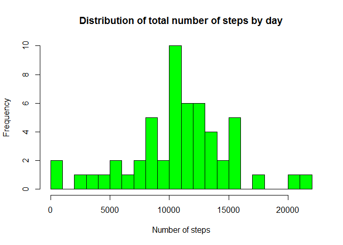
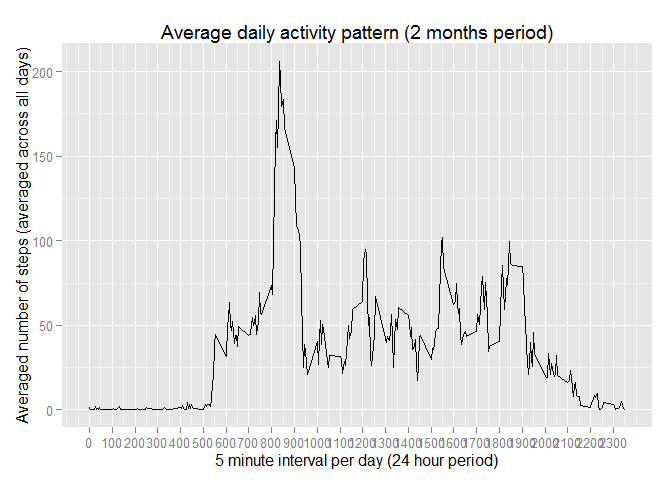
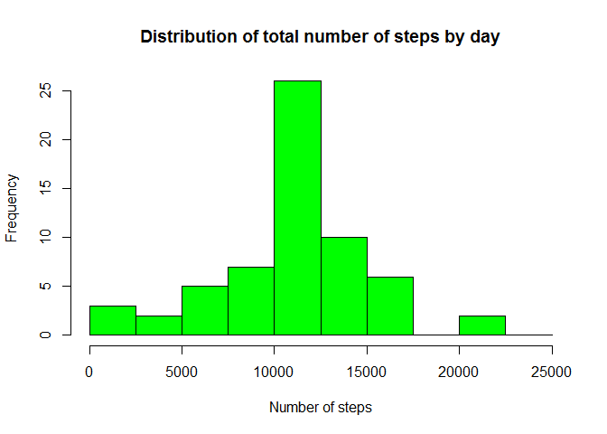

# Reproducible Research: Peer Assessment 1

#Personal activity monitoring device output analysis

This study makes use of data from a personal activity monitoring device. This device collects data at 5 minute intervals through out the day. The data consists of two months of data from an anonymous individual collected during the months of October and November, 2012 and include the number of steps taken in 5 minute intervals each day.

## Data

The data can be downloaded from the following url: [Activity monitoring data] (https://d396qusza40orc.cloudfront.net/repdata%2Fdata%2Factivity.zip)

The variables included in this dataset are:
- steps: Number of steps taking in a 5-minute interval (missing values are coded as NA)
- date: The date on which the measurement was taken in YYYY-MM-DD format
- interval: Identifier for the 5-minute interval in which measurement was taken

The dataset is stored in a comma-separated-value (CSV) file.

## Loading and preprocessing the data
Extract the dataset (csv file) from the zip file and load it with the required format.


```r
setwd("C:/Rafa/Study/jh_data_science/RepData_PeerAssessment1-master/RepData_PeerAssessment1-master")
unzip("activity.zip", overwrite = TRUE, exdir = ".")
raw_data = read.csv("activity.csv", sep = ",", header=TRUE, colClasses=c("numeric", "Date", "numeric"))
str(raw_data)
```

```
## 'data.frame':	17568 obs. of  3 variables:
##  $ steps   : num  NA NA NA NA NA NA NA NA NA NA ...
##  $ date    : Date, format: "2012-10-01" "2012-10-01" ...
##  $ interval: num  0 5 10 15 20 25 30 35 40 45 ...
```
## What is mean total number of steps taken per day?
For this analysis, we have ignored the missing values in the dataset.

**1.Make a histogram of the total number of steps taken each day**


```r
working_data = na.omit(raw_data)
my_data = tapply(working_data$steps, working_data$date, sum)
hist(my_data, 
     main="Distribution of total number of steps by day", 
     xlab="Number of steps", 
     breaks=20,
     col="green")
```

 

**2.Calculate and report the mean and median total number of steps taken per day**
First, let's show the mean total number of steps taken by day.

```r
mean(tapply(working_data$steps, working_data$date, sum))
```

```
## [1] 10766.19
```
Here let's show the median total number of steps taken by day.

```r
median(tapply(working_data$steps, working_data$date, sum))
```

```
## [1] 10765
```

## What is the average daily activity pattern?

**1.Make a time series plot of the 5-minute interval (x-axis) and the average number of steps taken, averaged across all days (y-axis)**


```r
library(ggplot2)
my_data = as.data.frame(
      as.table(
            tapply(working_data$steps, working_data$interval, mean)
            ), 
      stringsAsFactors=FALSE)
colnames(my_data) <- c("interval", "steps_mean")
my_data$interval=as.numeric(my_data$interval)
ggplot(my_data, aes(x=interval,y=steps_mean)) + 
      geom_line() + 
      ggtitle("Average daily activity pattern (2 months period)") + 
      xlab("5 minute interval per day (24 hour period)") + 
      ylab("Averaged number of steps (averaged across all days)") + 
      scale_x_continuous(breaks=seq(0,2355,100))
```

 


**2.Which 5-minute interval, on average across all the days in the dataset, contains the maximum number of steps?**

```r
my_data$interval[which.max(my_data$steps_mean)]
```

```
## [1] 835
```
This corresponds to the interval AM 8:35 - 8:40.

## Imputing missing values

**1.Calculate and report the total number of missing values in the dataset (i.e. the total number of rows with NAs)**


```r
my_data = raw_data
nrow(my_data[!complete.cases(my_data),])
```

```
## [1] 2304
```
The total number of missing values is 2304.

**2.Devise a strategy for filling in all of the missing values in the dataset. **

We are filling the missing values with the mean for that specific interval.

```r
my_data$steps[is.na(my_data$steps)] = 
      with(my_data, tapply(steps, interval, mean, na.rm=TRUE))
```
**3.Create a new dataset that is equal to the original dataset but with the missing data filled in.**

```r
summary(my_data)
```

```
##      steps             date               interval     
##  Min.   :  0.00   Min.   :2012-10-01   Min.   :   0.0  
##  1st Qu.:  0.00   1st Qu.:2012-10-16   1st Qu.: 588.8  
##  Median :  0.00   Median :2012-10-31   Median :1177.5  
##  Mean   : 37.38   Mean   :2012-10-31   Mean   :1177.5  
##  3rd Qu.: 27.00   3rd Qu.:2012-11-15   3rd Qu.:1766.2  
##  Max.   :806.00   Max.   :2012-11-30   Max.   :2355.0
```
Here we can see that now there are not NA values in the steps variable.

**4. Make a histogram of the total number of steps taken each day and Calculate and report the mean and median total number of steps taken per day. Do these values differ from the estimates from the first part of the assignment? What is the impact of imputing missing data on the estimates of the total daily number of steps?**

Let's first make an histogram of the total number of steps taken each day.


```r
hist_data = tapply(my_data$steps, my_data$date, sum)
hist(hist_data,
     main="Distribution of total number of steps by day",
     xlab="Number of steps",
     breaks=c(0,2500,5000,7500,10000,12500,15000,17500,20000,22500,25000),
     col="green")
```

 

Calculate and report the mean and median total number of steps taken per day.

First, take a look to the total number of steps

```r
mean(tapply(my_data$steps, my_data$date, sum))
```

```
## [1] 10766.19
```
Here let's show the median total number of steps taken by day.

```r
median(tapply(my_data$steps, my_data$date, sum))
```

```
## [1] 10766.19
```
The median and the mean calculated with the addition of the days impacted by the NA replacement are both 10766. The mean has not been impacted by imputing the missing data with the chosen strategy. On the other hand, the median is now 10766, that is different from the median obtain on the first part of the assignment. It seems the median correspond to one of the missing dates that has been imputed now.

## Are there differences in activity patterns between weekdays and weekends?

**1.Create a new factor variable in the dataset with two levels - "weekday" and "weekend" indicating whether a given date is a weekday or weekend day.**


```r
my_data$day_week = c("weekend", "weekday", "weekday", "weekday", "weekday", "weekday", "weekend")[as.POSIXlt(my_data$date)$wday+1]
my_data$day_week = as.factor(my_data$day_week)
```
Let's see the factor variable and the data split by the new field created.

```r
str(my_data$day_week)
```

```
##  Factor w/ 2 levels "weekday","weekend": 1 1 1 1 1 1 1 1 1 1 ...
```

```r
table(my_data$day_week)
```

```
## 
## weekday weekend 
##   12960    4608
```

**2.Make a panel plot containing a time series plot (i.e. type = "l") of the 5-minute interval (x-axis) and the average number of steps taken, averaged across all weekday days or weekend days (y-axis). See the README file in the GitHub repository to see an example of what this plot should look like using simulated data**

